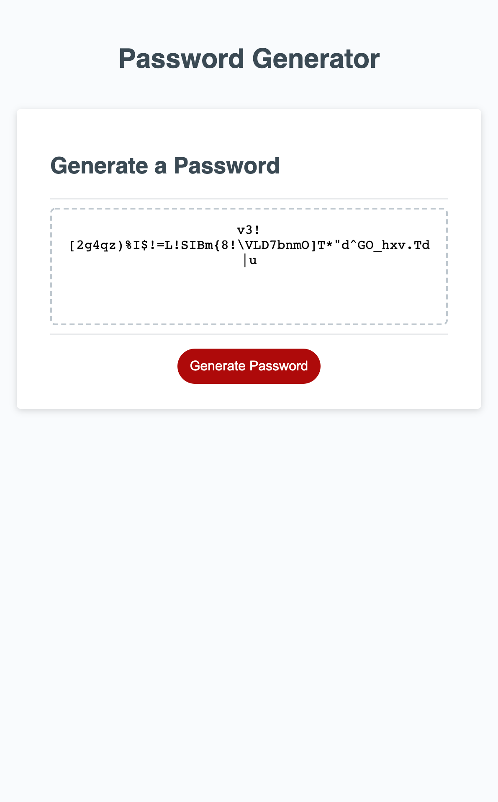

# Password Generator Page

## Purpose
A web utility to generate a random password string.  User can choose a length between 8 and 128 characters and choose to include upper case, lower case, numbers, and/or special characters.

## Built With
* HTML
* CSS
* JavaScript

## Links
* Deployed Website - https://rolanduwxcc.github.io/ch3-password-generator/
* GitHub Repo - https://github.com/rolanduwxcc/ch3-password-generator

## Contributions
* Warren Rowland

## Contact Info
* Warren Rowland - Find me on [Linked In](https://www.linkedin.com/in/linkedinrowland/) or [GitHub](https://github.com/rolanduwxcc)

## Screenshots

### ©️2020 Rolanduwxcc, Inc 